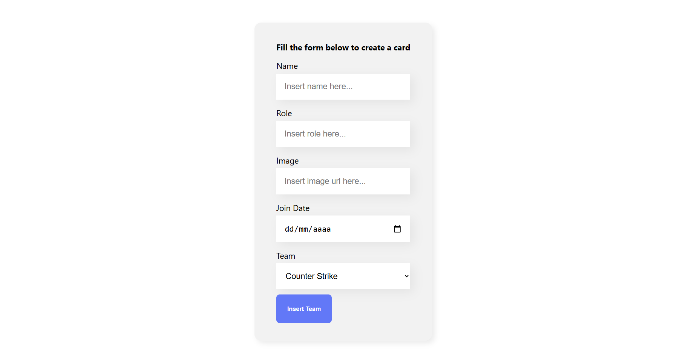
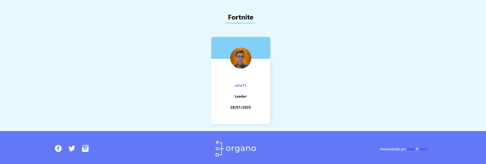

# first-react-app

## This is my first react project, a simple e-sports team creator. It's part of an [Alura's](https://www.alura.com.br/) react introduction course.

## I thought It was interesting, creating components and practicing my javascript knowledge was kinda fun.

## tbh, the array.map and array.filter are so helpful, this project really helped me improve my skills

## a few months later this project was re-visited, in order to refactor with Typescript.

## you can check the final result clicking [here](https://typescript-team-display-gi8df0irz-guilhermes-projects-5f434b4c.vercel.app/).

## Screenshots 📸

